# 🤖 Unsupervised Learning ML
 
* Evaluate the difference between data transformation techniques  
* Is PCA better than Kernel PCA?
* Is silhouette score best metric do use, try different evaluation metrics and comment on the result
* Try all unsupervised algorithms that you studied
* Compare between EM and DBSCAN and isolated random forest as anomaly detection algorithm
* Justify all your chooses and comment on every result
* Show how result of T-SNE differs with every choose you made   

## 🤔 Steps

<ol>
<li>Log Transformation - Clipping Method - Scaling Methods</li>
<li>PCA vs Kernel PCA </li>
<li>Kmeans vs Hierarchical clustering</li>
<li>EM vs DBscan vs Isolated RF - anomaly detection </li>
<li>Try different evaluation metrics + T-SNE</li>
</ol> 

## 📸 Visualizations from the Project

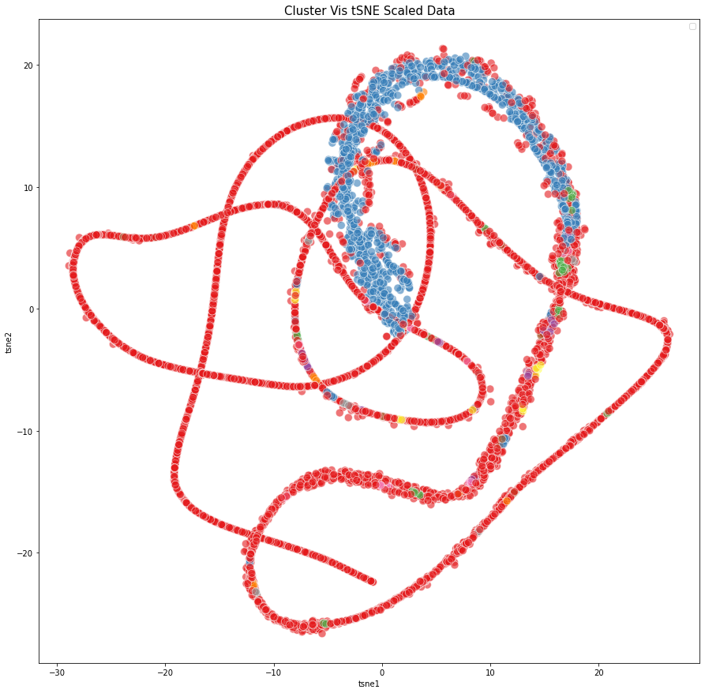
 

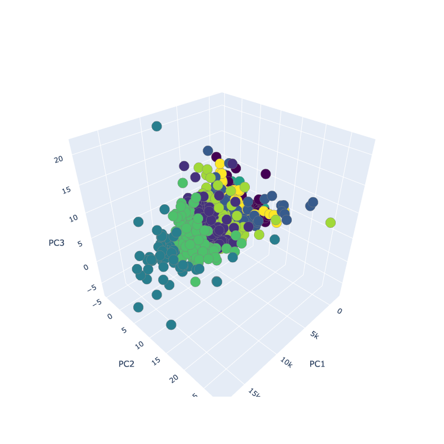
 

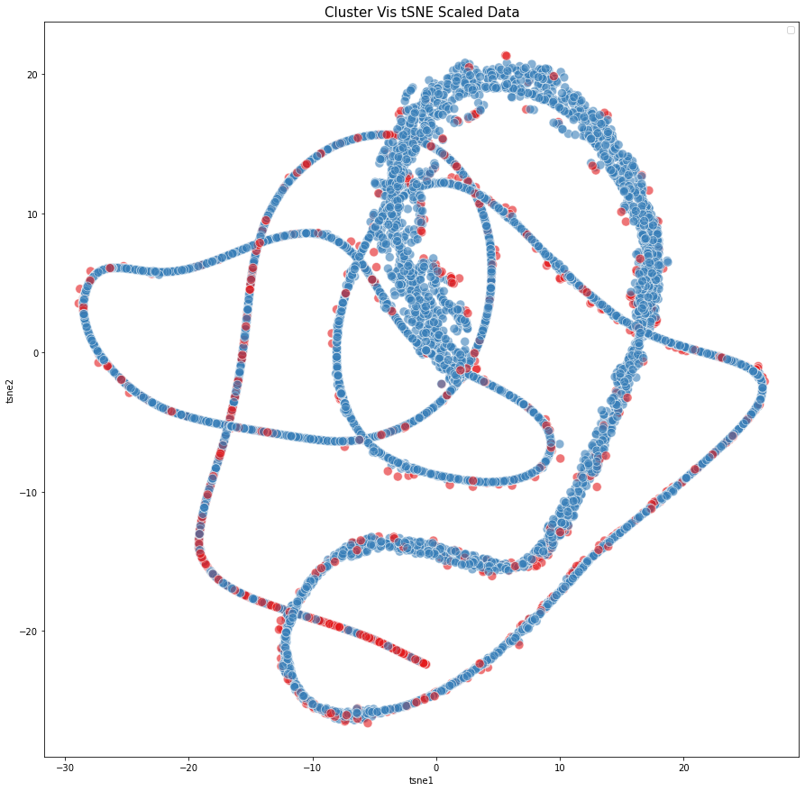
 

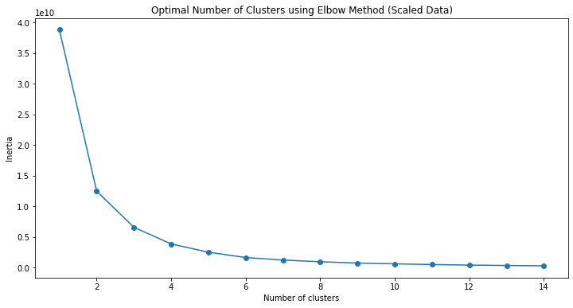
 

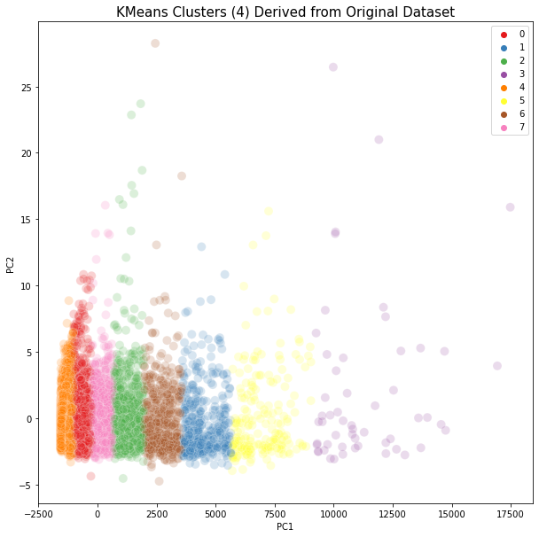
 

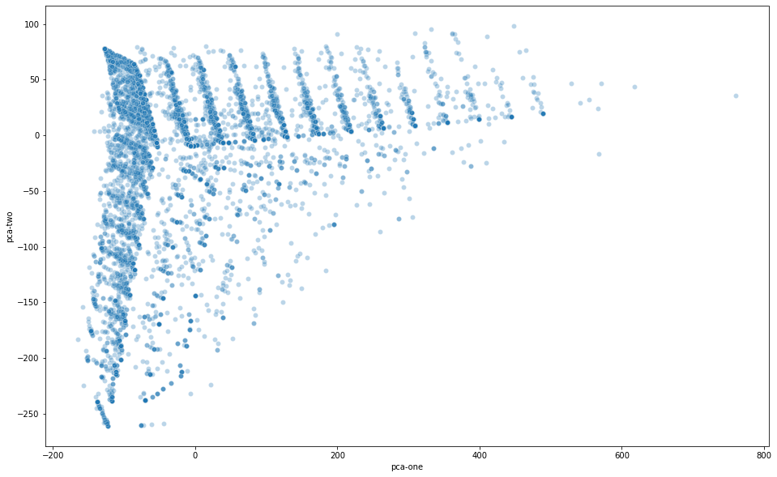
 

 

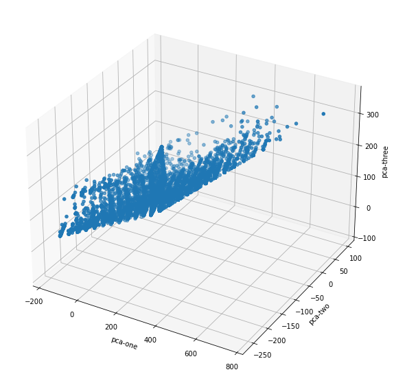
 

 

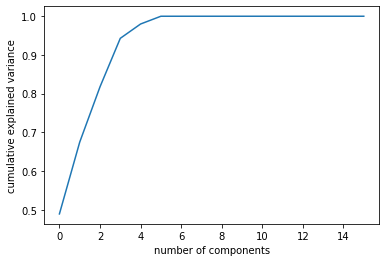
 

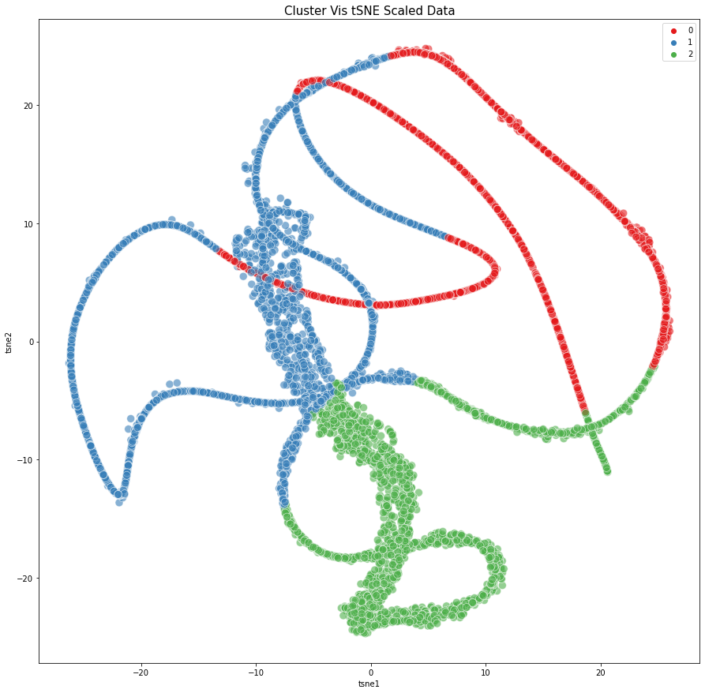
 

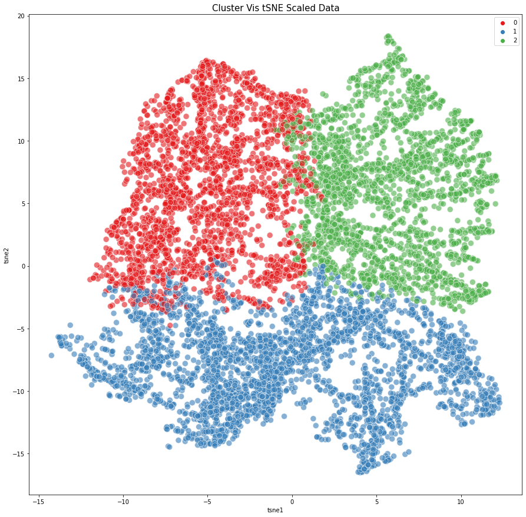
 

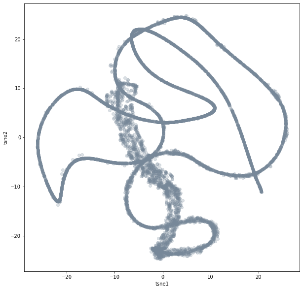
 

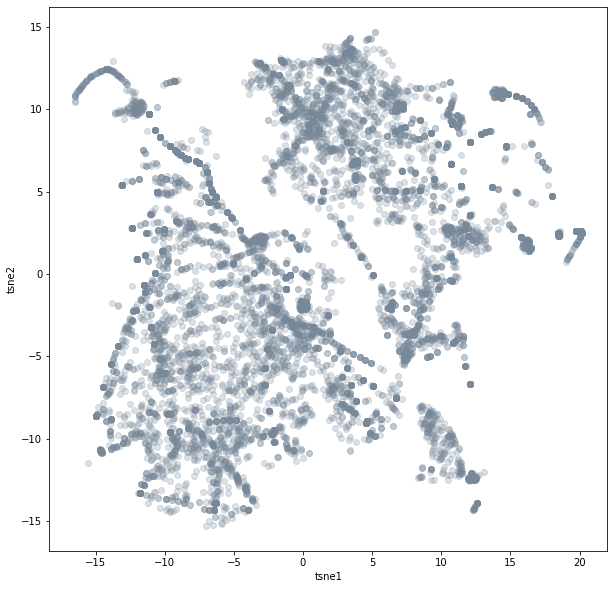
 